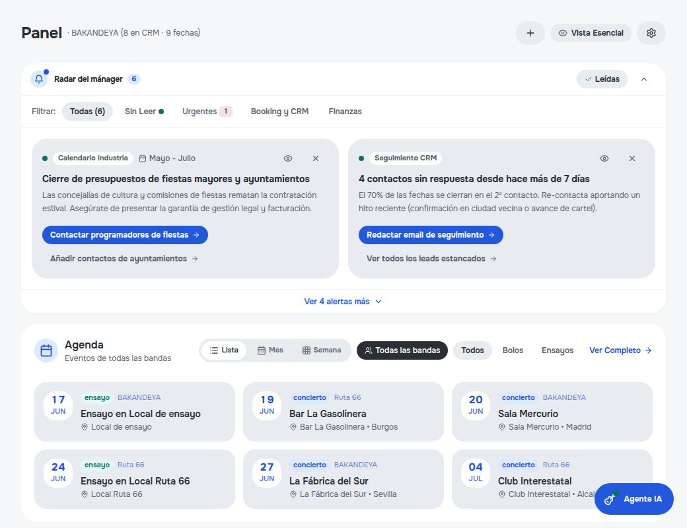
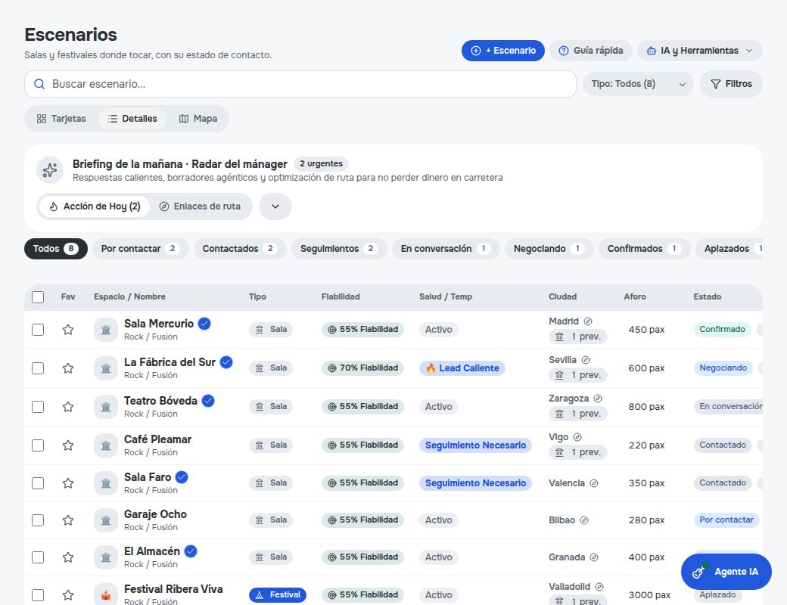
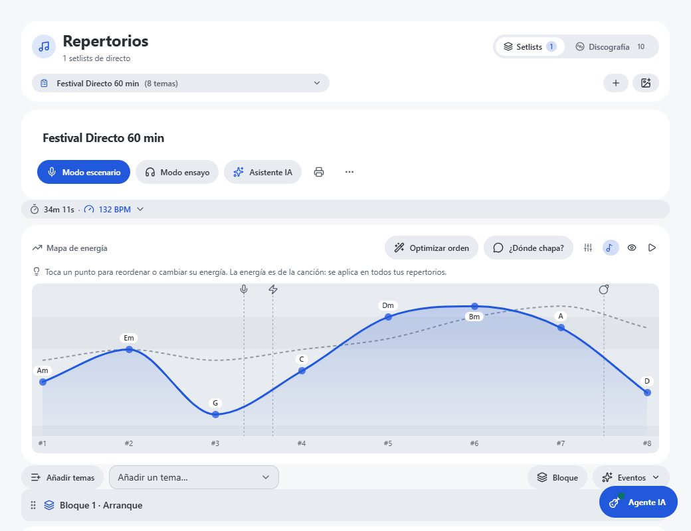
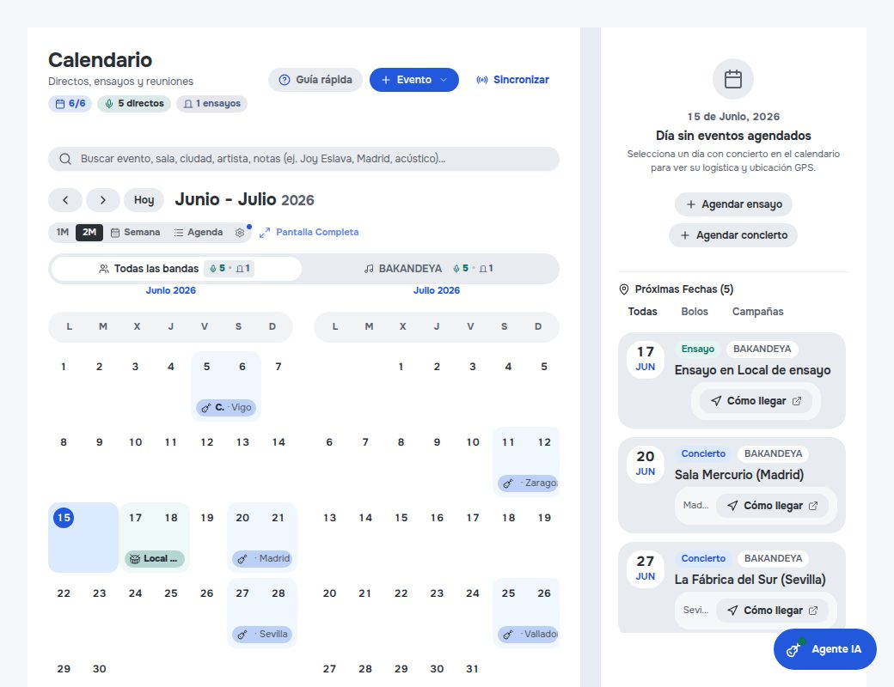

# BandManager.io

[](https://github.com/DiegoCalleB/BandsManager/actions/workflows/ci.yml)
[](https://github.com/DiegoCalleB/BandsManager/actions/workflows/docs.yml)
[](https://www.typescriptlang.org/)
[](LICENSE)
[](#seguridad)
[](./AGENTS.md)

El sistema operativo de una banda independiente: **encontrar salas, cerrar fechas, ensayar, tocar y cobrar desde un solo sitio**, con agentes de IA que hacen el trabajo repetitivo y una persona que aprueba lo importante. Pensado para grupos, solistas, monologuistas y cualquiera que tenga que buscar escenarios donde actuar. Es también el núcleo técnico de un Trabajo Fin de Máster sobre desarrollo de software asistido por IA agéntica (Máster de Desarrollo con IA, The Big School).

> Las reglas de desarrollo (seguridad, multi-tenancy, agentes, estilo) viven en **[AGENTS.md](./AGENTS.md)**. Este README es la puerta de entrada; no las duplica.

## Guía rápida para evaluadores

Autor: [@DiegoCalleB](https://github.com/DiegoCalleB). Este repositorio es el núcleo técnico del Trabajo Fin de Máster de Desarrollo con IA (The Big School). Está pensado para que se pueda **comprobar**, no solo leer: casi todo lo que afirma esta documentación se puede verificar con un comando o con un fichero concreto.

<table>
  <tr>
    <td></td>
    <td></td>
  </tr>
  <tr>
    <td></td>
    <td></td>
  </tr>
</table>

*Capturas de la banda de demo ficticia (Ruta 66), generadas por script.*

### Qué mirar para comprobar qué

| Quiero ver… | Dónde |
|---|---|
| Qué problema resuelve y para quién | [Para qué existe](#para-qué-existe) y [Qué hace](#qué-hace) |
| La arquitectura, en diez minutos | [docs/ARCHITECTURE.md](./docs/ARCHITECTURE.md) (diagramas de contexto y contenedores) |
| **Por qué** se decidió cada cosa, y qué se descartó | [docs/adr/](./docs/adr/README.md): 13 registros de decisión. Los retroactivos están marcados y sus alternativas son razonadas a posteriori |
| La API completa | [docs/api/REFERENCIA.md](./docs/api/REFERENCIA.md): todas las rutas, quién puede llamarlas y con qué límites, con enlace a la línea de código. Contrato máquina-legible en [openapi.json](./docs/api/openapi.json) |
| La seguridad y sus límites | [Seguridad](#seguridad), incluidos los [límites conocidos](#límites-conocidos-honestidad-antes-que-marketing) |
| Cómo se trabajó con agentes de IA | [AGENTS.md](./AGENTS.md) y [skills/](./skills/README.md): reglas compartidas, skills y tests que impiden que un agente rompa lo que no debe |
| Qué está hecho y qué no | [Hasta dónde hemos llegado](#hasta-dónde-hemos-llegado) |

### Comprobarlo uno mismo

Requiere Node 22.

```bash
npm ci
npm run typecheck     # tsc --noEmit
npm test              # suite de Vitest
npm run verify:docs   # la documentación coincide con el código: cifras, enlaces, rutas y contrato de API
```

`verify:docs` es la pieza más representativa del enfoque «documentación como código» ([ADR 0011](./docs/adr/0011-docs-as-code.md)): falla si el README cita una cifra que no cuadra o si alguien cambia una ruta sin regenerar el contrato de la API.

## Para qué existe

Una banda DIY hace, sin cobrar por ello, el trabajo de cinco profesionales: **booker** (buscar y convencer a las salas), **tour manager** (logística y rutas), **director musical** (ensayos y setlists), **contable** (quién cobra y quién paga) y **community manager** (redes y fans). La mayoría de la gente que toca pierde más horas en Excel, correos sin respuesta y WhatsApps que ensayando. BandManager.io convierte esas cinco figuras en una única plataforma asistida por IA.

Tiene tres finalidades reales, en este orden:

1. **Producto: quitarle trabajo de despacho a quien hace música.** El caso de uso central es el booking. La IA descubre salas, redacta un pitch breve y sin clichés con el tono de la banda, lee las respuestas y propone la réplica. La persona solo revisa y aprueba. Alrededor se construye lo que una banda necesita el día de la gira: calendario, repertorio, EPK, fans y finanzas.
2. **Negocio: un SaaS B2C para el músico independiente.** Escalonado por planes (de gratis a 79 €/mes) y con un camino de ingresos extra, la comisión por acuerdos de concierto, ya especificado en [`docs/planes/`](./docs/planes/). Hoy los planes de pago están desactivados a propósito: toda banda nueva entra en modo *promo* mientras se valida el producto.
3. **Académica: demostrar cómo se construye software serio con IA agéntica.** Es el TFM. El repositorio documenta cómo se trabaja con agentes de código (Claude Code, Gemini, Cursor, Open Code) con reglas compartidas, skills, hooks y tests que impiden que un agente rompa lo que no debe. La parte de IA *dentro* del producto y la parte de IA *que construye* el producto son dos caras del mismo experimento.

### Qué lo diferencia

- **Human-in-the-loop de verdad.** Un agente nunca envía un email por su cuenta. El código lo impide: sin aprobación humana, interruptor global `AGENT_EMAIL_MODE=send` y modo de despacho explícito, solo se crean borradores.
- **Multi-tenancy estricta.** Ninguna banda ve datos de otra. La banda se resuelve siempre en el servidor desde la sesión, nunca desde lo que envía el cliente, y un test estático rompe el build si alguien reintroduce el patrón inseguro.
- **Cada banda manda su propio correo.** Los pitches salen del buzón de la banda (Gmail OAuth2 o IMAP/SMTP), no de un dominio genérico de la plataforma: el correo llega firmado por la propia banda.
- **Todo en uno, pero simple.** Mucha funcionalidad con una interfaz que no satura: la complejidad vive en el backend y la IA, y la pantalla sigue las reglas de [AGENTS.md §6](./AGENTS.md).

## Qué hace

Cada módulo aparece en el menú lateral según el plan de la banda (ver [Planes](#planes)). Los límites y permisos se validan también en el servidor, no solo en la interfaz.

### Booking: encontrar salas y conseguir fechas

El CRM de booking (`BookingCRM`) es el centro de la app. Cada sala, festival o medio es un *lead* con un embudo de estados (`nuevo` → `contactado` → `respondido` → `negociando` → `confirmado`, más `aplazado` y `no_interesado`) y una cola aparte de revisión humana de lo que redactan los agentes.

- **Descubrimiento de salas:** búsqueda en Google Places, campañas de búsqueda masiva por ciudad, artistas similares, historial de setlist.fm, MusicBrainz, Bandsintown y fuentes de datos culturales abiertos. Detección de duplicados antes de crear un lead.
- **Enriquecimiento:** scraping de contacto, direcciones y web de cada sala, validación de emails (MX y entregabilidad), y avisos de eventos locales que compiten por la misma audiencia.
- **Importación y exportación:** Excel, con acciones en bloque sobre la selección.
- **Campañas:** envíos segmentados con plantillas de asunto y cuerpo por tipo de lead (salas, festivales, discotecas, medios, grupos, managements, ayuntamientos) y simulación de booking antes de lanzar.
- **Vistas de apoyo:** secciones separadas para salas, medios y management, y mapa de salas.

### Agentes de IA (con aprobación humana)

Cuatro agentes se reparten el ciclo; un planificador deposita los trabajos en una cola (`agent_jobs_queue`) en lugar de ejecutarlos dentro de Express.

| Agente | Qué hace |
|---|---|
| **Scout** | Descubre y enriquece salas, las deja en `nuevo`. |
| **Redactor** | Escribe un pitch breve (menos de 120 palabras) con el *Band DNA* y el *Tone DNA* de la banda. Un juez LLM (`pitchJudge`) lo evalúa y lo refina. Aprende de las ediciones humanas. |
| **Enviador** | Solo actúa sobre leads aprobados. Respeta la ventana comercial de la banda, un tope diario y no reintenta rebotes. |
| **Lector** | Revisa la bandeja cada ~60 s, empareja respuestas por hilo, analiza sentimiento e intención, y propone la réplica. |

Nada sale sin que una persona apruebe el borrador. Con `AGENT_EMAIL_MODE=draft` (por defecto) el Enviador solo deja borradores en la bandeja de la banda. Cada banda conecta su propio buzón, preferentemente por Gmail OAuth2 o, si no, por IMAP/SMTP. Los fallos de negocio esperables (sala sin email, buzón no conectado) se registran en un panel propio.

### Negociación y acuerdos

- **Copiloto de acuerdo y logística** sobre cada lead: caché, taquilla, rider y hospitalidad.
- **Acuerdos de concierto** que se envían a la sala por un enlace público con token; la sala los revisa y firma sin crear cuenta.
- **Simulador de punto de equilibrio** por concierto: ingresos, gastos y ruta con cálculo de combustible.
- **Aportaciones por acuerdo:** una banda puede apoyar un bolo con una donación (Stripe).

### Calendario, ensayos y gira

- **Calendario** de conciertos y ensayos con tiempo meteorológico por evento, recordatorios, sincronización externa y hoja de ruta.
- **Ensayos:** convocatoria, orden del día, cronómetro por bloque, grabación y acta, y modo local en vivo.
- **Tour Manager:** rutas, logística y tarjeta de direcciones por fecha.

### Repertorio y setlists

- **Canciones y discografía:** catálogo con filtros, álbumes, portadas, letras, acordes, notas por miembro y subida de audio en bloque.
- **Análisis de audio:** tonalidad, BPM, densidad de onsets, energía y *cues*, tanto del audio de la banda como del original en las versiones.
- **Setlists:** gráfico de energía, comprobación de compatibilidad de tonalidad/BPM entre temas contiguos, análisis con IA, un generador de setlist perfecto y exportación a PDF.
- **Modo Escenario** para tocar en directo con el reproductor del setlist, afinador y metrónomo.
- **Concierto → Álbum:** procesa una grabación en directo (descarga, análisis, detección de cortes) y la convierte en canciones del catálogo.

### Estudio de canciones y música IA

- Generación de pistas de acompañamiento y jingles con Gemini, y bases rítmicas con instrumentos sintetizados (guitarra, violín, handpan, percusión) con Tone.js.
- Separación de stems en la nube y transposición de audio, con caché y cola de reintentos.
- Exportación a MIDI, y subida de la estructura de una canción.
- Las maquetas y stems son de la banda: se guardan en Storage bajo una ruta acotada por `bandId`.

### EPK y fans

- **EPK (dossier web):** bloques editables de perfil, música, prensa, archivos, donaciones y firma con QR; plantillas; traducción; logo generado con IA. La ruta pública `/epk` se renderiza fuera del traductor para que no toque nombres de canciones.
- **Seguimiento:** aperturas, clics y descargas del dossier, con tokens firmados.
- **Fans:** captación por QR con consentimiento RGPD explícito, vista de comunidad y cuadro de mando, y página de aterrizaje.
- **QR:** exportación de códigos para conciertos y difusión.

### Contenido y redes

- **Reels:** a partir de vídeos de la banda (YouTube, TikTok, Instagram) detecta fragmentos con energía, corta clips con ffmpeg, escribe el copy con el Tone DNA y los muestra en un mockup de móvil.
- **Crecimiento social:** métricas reales de redes, plan de crecimiento y publicación programada.

### Finanzas y merchandising

- Ingresos y gastos de la banda con resumen, y las métricas de cada concierto.
- Merchandising (de momento solo visible para administradores).

### Agente Mánager (chat)

Chatbot con herramientas (`server/services/chatTools.ts`) para consultar y actuar sobre los datos de la banda, con modo de conversación conmutable.

### Cuentas, multi-banda y onboarding

- Una persona puede pertenecer a varias bandas (plan Cabeza de Cartel hasta 5) y cambiar entre ellas; los miembros se invitan por un enlace de un solo uso.
- Asistente de configuración inicial de 12 pasos tras el primer login y tutoriales por módulo.
- Idioma, tema, tipografía y notificaciones (toasts y push del navegador) configurables por usuario.

### Práctica, directo y estudio personal

- **Modo práctica** (`PracticeModePanel`): reproduce varias pistas de una canción a la vez, con transposición en tiempo real, bucle de compases, metrónomo y balance de volumen. **Modo Escenario** para tocar en directo siguiendo el setlist.
- **Afinador y metrónomo** integrados, y un visor de **acordes** por canción.
- **Audio por canción:** forma de onda, pistas por instrumento, ideas con comentarios, y ayudas para llevar los stems a un DAW (guía para Cubase incluida).

### Landing pública, PWA y demo

- **Landing en `/`** para quien no tiene sesión, con capturas y una banda de demo ficticia (`e2e/fixtures/demoBand.ts`) generadas por script, más una landing específica para el TFM (`/tfm`).
- **PWA instalable** (manifest, iconos, service worker) y **notificaciones push** del navegador.
- **Página pública de acuerdo** (`/deal/:token`), **EPK público** (`/epk`) y **captación de fans**: las únicas rutas que se abren sin cuenta, por eso llevan limitador de ritmo y tokens firmados.

### Seguridad y fiabilidad

Se trata como parte del producto, no como un añadido. Las medidas están en [Seguridad](#seguridad) y la detección de errores en [Errores en tiempo real](#detección-de-errores-en-tiempo-real).

### Planes

| Plan | Precio | Créditos IA/mes | Para qué |
|---|---|---|---|
| Promo / Promo+ | 0 € | 0 | EPK, QR, fans, calendario y repertorio (Promo+ añade setlists y discografía). |
| Ensayo | 0 € | 100 | Primer contacto con booking y agentes (10 leads). |
| Local | 15 € | 300 | Booking con 50 leads y contactos de medios. |
| De Gira | 29 € | 800 | Todo ilimitado en una banda, más Tour Manager y Reels. |
| Cabeza de Cartel | 79 € | 2.500 | Hasta 5 bandas, finanzas y agentes en paralelo. |

Los límites exactos y el módulo de cada plan salen del código (`src/utils/planPermissions.ts`, `server/utils/planLimits.ts`); la tabla de [AGENTS.md §2.3](./AGENTS.md) es la referencia. Los créditos IA se descuentan por banda y no tienen relación con el ledger de deuda de IA.

**Principio central: human-in-the-loop.** Ningún agente envía un email sin aprobación humana explícita (detalle en [AGENTS.md §3](./AGENTS.md)).

## Seguridad

Una banda guarda en la plataforma maquetas inéditas, contactos privados de programadores y el acceso a su correo. Por eso la seguridad se diseñó en capas: ninguna es la única barrera, y la última (una persona que aprueba) sigue ahí aunque falle otra. Las reglas completas, con su porqué, están en [AGENTS.md §2](./AGENTS.md).

### Defensa por capas

| Capa | Qué se hace | Dónde |
|---|---|---|
| **Aislamiento por banda** | La banda se resuelve siempre en el servidor desde la sesión (`getTargetBandId`); está prohibido leer `band_id` del cuerpo o de `x-band-id` para autorizar. Toda ruta con `:bandId` comprueba `puedeEscribirEnBanda` (403) y las cachés se filtran por banda. Un test estático rompe el build si reaparece `cleanBandId(objeto.band_id \|\| bandId)`. | `server/utils/bandAccess.ts`, `server/db/__tests__/bandIdTrustBoundary.test.ts` |
| **Autenticación** | Login con Google verificado contra Google en el servidor, sin fiarse del email del cliente. Contraseñas con PBKDF2-SHA512 (100.000 iteraciones, sal propia) y comparación en tiempo constante. Sesión con caducidad de 30 días. | `server/auth.ts`, `server/utils/googleVerify.ts` |
| **Cuentas y privilegios** | La contraseña del admin solo sale de `ADMIN_PASSWORD` (mínimo 12 caracteres), nunca del código. Las cuentas especiales se reconocen por id o email exacto. El plan solo cambia por Stripe. Un líder solo restablece cuentas que son únicamente de su banda. | `server/utils/cuentaBrais.ts`, `server/routes/users.ts` |
| **Recuperación e invitaciones** | El reseteo exige el identificador exacto, admite 5 intentos por código y no lo escribe en logs. Las invitaciones usan un token de un solo uso del que solo se guarda el hash. | `server/utils/invitacion.ts` |
| **Limitación de ritmo** | Límites por IP o por usuario según la superficie (tabla abajo). La IP se toma de la **última** entrada de `X-Forwarded-For`, porque la primera la escribe el cliente. | `server/middleware/rateLimiter.ts` |
| **Tamaño de cuerpo** | 1 MB para anónimos y 50 MB solo con sesión válida, para que nadie sin cuenta fuerce al servidor a bufferizar archivos enormes. | `server/middleware/limiteCuerpo.ts` |
| **Cabeceras HTTP** | `helmet` con HSTS de un año con preload, `X-Frame-Options: sameorigin`, `nosniff` y `Referrer-Policy` ajustada. | `server.ts` |
| **SSRF** | Todo `fetch` del servidor a una URL de usuario valida con `esUrlExternaSegura`, ancla la IP resuelta, revalida cada redirección y bloquea rangos privados y reservados (incluido IPv4 mapeado en IPv6). | `server/utils/ssrfGuard.ts` |
| **Inyección** | Consultas parametrizadas con el cliente tipado de Supabase. Todo texto de usuario que va a un correo pasa por `escapeHtml`. Validadores contra *path traversal* en rutas de archivos. | `server/utils/html.ts` |
| **Inyección de prompt** | Los datos scrapeados de webs y los emails recibidos de salas pasan por `sanitizeExternalText` y van marcados en el prompt como dato, no como orden. Es defensa en profundidad: la barrera real sigue siendo la aprobación humana. | `server/utils/promptSafety.ts` |
| **Seguimiento y webhooks** | Aperturas, clics y telemetría del EPK solo se registran con un token **firmado**; los clics redirigen solo a destinos firmados o dominios conocidos. El webhook de Resend exige firma Svix. | `server/utils/trackingSeguro.ts`, `server/routes/tracking.ts` |
| **Gmail OAuth** | El `state` lleva un nonce firmado más una cookie HttpOnly y se consume una sola vez. Al desconectar se revoca el token en Google. | `server/routes/gmailOAuth.ts` |
| **Propiedad de las obras** | Maquetas y stems en Supabase Storage con ruta `stems/{bandId}/…`, sin URLs predecibles ni accesibles sin pertenecer a la banda. Las subidas a Storage, no al disco efímero. | `server/utils/storage.ts` |

Límites de ritmo vigentes:

| Superficie | Límite |
|---|---|
| Login | 10 por minuto |
| Registro | 10 cada 10 min |
| Endpoints públicos que escriben | 30 por minuto |
| Reenvío de email | 5 cada 10 min |
| IA (por usuario) | 20 cada 5 min |
| Render de clips (por usuario) | 10 cada 5 min y 2 a la vez |
| Donaciones (por usuario) | 10 cada 5 min |

### Agentes: el riesgo más específico de este proyecto

Un agente que escribe a terceros en nombre de la banda es el vector más delicado, así que tiene sus propios candados:

- **Sin aprobación humana no sale nada.** El Enviador exige estado aprobado, `AGENT_EMAIL_MODE=send` y un modo de despacho directo explícito.
- **Tope diario** (`AGENT_DAILY_SEND_CAP`, 30), guarda contra ejecuciones simultáneas y los rebotes no se reintentan.
- La consulta del Enviador va siempre acotada a la banda y a los estados de envío.
- El Lector solo enriquece el email de un lead cuando el emparejamiento es por hilo, nunca por dominio o asunto, para que un tercero no pueda inyectarse en un lead ajeno.
- Un borrador de Gmail que desaparece no cuenta como enviado: se confirma contra la carpeta de Enviados.

### Integridad de los datos

- **Migraciones SQL idempotentes**, cada una en su transacción: si falla, se revierte y el despliegue no se promociona. Una migración aplicada no se edita.
- **Tests de contrato con el esquema** (`schemaContract`, `dbRoundTrip`) que detectan si el servidor escribe una columna que no existe o si un trigger no termina en `RETURN NEW`.
- **Escritura tolerante:** si falta una columna, se guarda el resto y se avisa con una cabecera en lugar de perder datos en silencio.
- **Guardado optimista con reversión** en el cliente, para no mostrar «guardado» antes de que el servidor lo confirme.
- Migraciones de **historial de cambios** y de **logs de auditoría solo-añadir**.

### Cómo se comprueba

- Los tests de seguridad corren en cada CI (`npm test`): frontera de confianza de `band_id`, SSRF, tracking firmado, autorización de rutas, contraseña de admin, invitaciones y webhook de Stripe.
- Todo lo que toca `band_id` o dinero se escribe **test primero** (excepción de TDD de [AGENTS.md §5.3.1](./AGENTS.md)). Los tests verifican invariantes, no la implementación de hoy.
- La CI ejecuta el typecheck, las guardas de diseño, el *ratchet* de ESLint, la verificación de la documentación, los tests unitarios y los E2E.
- Los agentes de código deben pasar `/security-review` cuando tocan `band_id`, autenticación, `fetch` de URLs de usuario, subidas o el envío de emails.

### Límites conocidos (honestidad antes que marketing)

No todo está blindado y conviene tenerlo presente:

- **Row Level Security de Supabase no restringe nada.** Las políticas de `supabase_schema.sql` son todas `USING (true)`. El aislamiento entre bandas es 100 % de aplicación, sin una red de seguridad por debajo.
- **No hay `Content-Security-Policy`.** Está desactivada porque la app embebe Stripe, YouTube, Spotify y Google Translate. Un fallo de XSS tendría menos contención.
- **La cookie de sesión no es `HttpOnly`** a propósito, porque el cliente también usa el token desde `localStorage`. Migrar a sesión solo por cookie está en el backlog.
- **El limitador de ritmo vive en memoria del proceso.** Se reinicia al desplegar y no se comparte si se escalara a varias instancias. Además solo cubre las superficies de la tabla: el resto de endpoints mutantes confía solo en `requireAuth`.
- **Las contraseñas de aplicación de correo se guardan sin cifrar** en Supabase (se ocultan en las respuestas, no en reposo). Es uno de los dos bloqueantes antes de abrir a usuarios reales.
- **La CI no ejecuta escaneo de dependencias ni de secretos** (`npm audit`, Dependabot, CodeQL o similares).
- Se aceptan todavía hashes de contraseña antiguos de 1.000 iteraciones por compatibilidad.

Los riesgos legales (YouTube, RGPD, baja en emails comerciales) están en [AGENTS.md §8](./AGENTS.md).

## Detección de errores en tiempo real

Antes, un fallo que nadie esperaba terminaba en un `console.error` y nada más: nadie se enteraba hasta que una banda avisaba. Hay **dos capas con responsabilidades distintas**, para que un error de negocio esperable no ahogue a un bug de verdad.

| Capa | Para qué | Dónde se ve |
|---|---|---|
| **`agent_execution_logs`** (Supabase) | Fallos de **negocio esperables** de los agentes: banda sin cuenta de email conectada, sala con email inválido, rebote. | Panel propio de la app (historial de ejecuciones y monitor de la cola de trabajos). |
| **Sentry** | Bugs que **nadie anticipó**: excepciones sin capturar en el servidor y errores de React en el navegador. | Consola de Sentry. |

Regla de oro: si el fallo es «de negocio, esperable», va al panel de agentes; si es «nadie lo vio venir», a Sentry.

### Sentry en el servidor (`@sentry/node`)

Se inicializa al arrancar (`server/utils/errorTracking.ts`) y reporta:

- **Promesas rechazadas sin capturar** (`unhandledRejection`). El handler mantiene vivo el proceso, para que un fallo puntual no tumbe a todas las bandas, y además lo notifica.
- **Cualquier error que llega al manejador final de `/api/*`**, con el método y la URL de la petición como contexto.
- **El worker de la cola de agentes**, con `jobId`, tipo de agente y banda, para saber qué trabajo y de quién falló.
- **El planificador de agentes y el radar de campañas**, indicando en qué fase falló.

### Sentry en el navegador (`@sentry/react`)

Se inicializa en `src/main.tsx` (`src/utils/errorTracking.ts`):

- El **`ErrorBoundary`** de React captura los errores de render con su contexto, así que una pantalla rota no deja la app en blanco.
- **Session Replay:** graba el 10 % de las sesiones y el **100 % de las que terminan en error**, para ver qué hizo la persona antes del fallo.
- **Muestreo de trazas del 10 %** para rendimiento.
- **Filtros anti-ruido:** descarta el ruido de HMR de Vite, de `ResizeObserver`, de bloqueadores de anuncios y todo error cuya pila venga de una extensión del navegador (`chrome-extension://`, `moz-extension://`).

### Estado: activo en producción

Sentry **está activado** en producción, en servidor y navegador, con `SENTRY_DSN` y `VITE_SENTRY_DSN` definidos en el entorno de despliegue.

El código es **pasivo por diseño**: sin esas variables Sentry es un no-op total y ni siquiera se carga el SDK. Por eso en local, en los tests y en el E2E no cambia nada y nadie envía ruido a la consola de Sentry desde su máquina.

### Otras señales de salud

- **Healthcheck** en `/api/health`, que Railway usa para decidir si un despliegue está vivo, con reinicio automático ante fallo. Un E2E (`health.spec.ts`) lo vigila.
- **Cola de agentes:** estadísticas, métricas y recuperación de trabajos colgados (los `processing` con bloqueo vencido más de 10 minutos se recuperan solos).
- **Auditoría de ejecuciones** de los agentes con su propio panel (`/agent-runs`).

### Lo que mejoraría el rendimiento de Sentry ahora que está activo

- **Sin source maps ni `release`.** El build de producción genera `sourcemap: false` y no se etiqueta la versión, así que las pilas de Sentry salen minificadas y no se agrupan por despliegue. Es lo primero que conviene arreglar, porque cada error que llega ya está llegando sin símbolos legibles.
- **Cobertura parcial en el servidor:** hay unas 280 llamadas a `console.error` y solo 9 a `captureError`. Un fallo capturado por un `try/catch` que solo escribe en consola no llega a Sentry.
- **Sin trazas de rendimiento en el servidor** (`tracesSampleRate: 0`): solo se reportan errores.
- **Las alertas** (correo, Slack, umbrales) se configuran en la consola de Sentry, no están versionadas en el repositorio.
- **Replay y datos de terceros:** la app maneja contactos de salas y contenido de bandas; Replay está activo, así que conviene revisar qué se enmascara en las grabaciones.

## Stack

- **Frontend:** React 19 + Vite 6 + Tailwind CSS v4, `motion`, Tone.js.
- **Backend:** Express 4 + TypeScript en Node 22 (`server.ts`), estado en memoria sincronizado con Supabase.
- **Datos:** Supabase (PostgreSQL) como única fuente de verdad, Supabase Storage para multimedia.
- **IA:** Gemini (`@google/genai`), con DeepSeek/OpenAI opcionales; Replicate/fal para stems.
- **Servicios:** Stripe (planes), Resend (emails transaccionales), Sentry (errores en producción).
- **Despliegue:** Railway (`railway.json`, healthcheck en `/api/health`); las migraciones de `supabase/migrations/` se aplican solas en `npm start`; los `.sql` sueltos de `supabase/` no (ver [ADR 0008](./docs/adr/0008-migraciones-sql-versionadas.md)).

## Puesta en marcha

Requiere Node 22.

```bash
npm install
cp .env.example .env     # mínimo: SUPABASE_URL, SUPABASE_SERVICE_ROLE_KEY, GEMINI_API_KEY
npm run dev              # Express + Vite en http://localhost:3000
```

Sin `.env` la app también arranca, con los usuarios semilla de `src/db_seed.ts` y estado en memoria, pero sin IA ni Supabase reales. Cada integración opcional (Stripe, Resend, Gmail OAuth, Sentry, stems) se degrada sola si falta su variable; la referencia completa está comentada en [`.env.example`](./.env.example).

`AGENT_EMAIL_MODE` está en `draft` por defecto: los agentes dejan borradores y **no envían** hasta que se pone a `send` en el servidor.

## Scripts

| Comando | Para qué |
|---|---|
| `npm run dev` | Servidor de desarrollo. |
| `npm run build` / `npm start` | Typecheck + build / migraciones y servidor de producción. |
| `npm run typecheck` | `tsc --noEmit`. |
| `npm test` | Tests unitarios (Vitest). |
| `npm run check:fast` | Typecheck + test de la frontera de confianza `band_id`. |
| `npm run test:e2e` | Smoke suite y journey de onboarding (Playwright, sin credenciales). |
| `npm run test:visual` | Regresión visual (`:update` solo para cambios de diseño deliberados). |
| `npm run lint:eslint` | ESLint (la deuda existente va con ratchet en CI). |
| `npm run migrate:check` | Lista las migraciones SQL pendientes. |
| `npm run verify:docs` | Comprueba que las rutas citadas en la documentación existen. |
| `npm run graph:sync` | Regenera el grafo de conocimiento de `docs/knowledge_graph/`. |

## Estructura

```
server/        Express: routes/ (HTTP) · services/ (agentes, scheduler, emails) · db/ (Supabase) · utils/ · middleware/
src/           React: components/ · hooks/ · utils/ · services/api.ts (cliente HTTP único) · context/
supabase/      Migraciones SQL idempotentes (el esquema completo está en supabase_schema.sql)
e2e/           Playwright: smoke, journey y regresión visual
scripts/       Migraciones, auditorías de diseño y utilidades de desarrollo
skills/        Skills para agentes de código (espejadas en .claude/, .gemini/, .opencode/ y .cursor/)
docs/          planes/ (especificaciones) · referencia/ (arquitectura, diseño) · knowledge_graph/ (Obsidian)
```

El mapa detallado está en [AGENTS.md §7](./AGENTS.md). El backlog de producto, en [BACKLOG.md](./BACKLOG.md).

## Documentación

- [AGENTS.md](./AGENTS.md): reglas del proyecto (precedencia sobre convenciones genéricas).
- [docs/referencia/](./docs/referencia/): arquitectura del motor de audio y stems, sistema de diseño Espectro, manual de negociación del Redactor, compatibilidad entre herramientas de IA.
- [docs/planes/](./docs/planes/): anti-fraude y acuerdos de gira, gestión de tokens IA, BandSplit.
- [docs/knowledge_graph/](./docs/knowledge_graph/index.md): grafo de arquitectura navegable en Obsidian.
- [docs/ARCHITECTURE.md](./docs/ARCHITECTURE.md): vista de arquitectura en diagramas (contexto y contenedores), para leer en 10 minutos.
- [docs/api/](./docs/api/index.html): referencia de la API generada del código (OpenAPI 3.1, `docs/api/openapi.json`), con autenticación y límites de cada ruta.
- [docs/adr/](./docs/adr/README.md): registro de decisiones de arquitectura (ADR), con las alternativas descartadas.
- [docs/referencia/DOCUMENTACION_ARQUITECTURA_SISTEMA.md](./docs/referencia/DOCUMENTACION_ARQUITECTURA_SISTEMA.md): arquitectura del motor de audio y stems.

## Hasta dónde hemos llegado

*Situación a 6 de octubre de 2026.* La aplicación es completa y funciona de punta a punta; lo que queda es validar con bandas reales, reactivar el cobro y cerrar riesgos legales.

**Tamaño del proyecto:** unas 270.000 líneas de TypeScript (≈197.000 en `src/`, ≈76.000 en `server/`), 358 rutas HTTP (307 declaraciones de handler; el resto son alias, ver [docs/api](./docs/api/index.html)), 57 tablas en producción (con RLS activo en todas), 43 migraciones SQL en el runner, 273 componentes React y 2.109 tests unitarios declarados (casos `it`/`test` del código; Vitest ejecuta más por los parametrizados), además de los E2E de Playwright y 15 capturas de regresión visual. Las cifras las comprueba `npm run verify:docs` en cada cambio de documentación.

### Construido y funcionando

| Área | Estado |
|---|---|
| Booking CRM, descubrimiento y enriquecimiento de salas | Funcional, con importación y exportación. |
| Agentes Scout, Redactor, Enviador y Lector | Funcionales, con cola de trabajos, tope diario y revisión humana. |
| Acuerdos de concierto con enlace público y firma por nombre, cargo y marca de tiempo, con hash SHA-256 | Funcional. |
| Repertorio, setlists, análisis de audio, estudio y stems | Funcional. |
| Calendario, ensayos y Tour Manager | Funcional. |
| EPK público, fans con consentimiento RGPD y QR | Funcional. |
| Reels, redes y publicación programada | Funcional. |
| Multi-banda, invitaciones, onboarding de 12 pasos y PWA | Funcional. |
| Landing pública con banda de demo | Funcional, con salvedades (ver deuda). |
| Seguridad: multi-tenancy, SSRF, inyección de prompt, auditorías de octubre | Hecho y cubierto por tests. |

### Construido pero a medias

- **Facturación con Stripe:** el flujo existe y tiene tests, pero está desactivado a propósito y hay arreglos pendientes (idempotencia, cancelación al cambiar de plan, descuento de créditos en servidor) que hay que cerrar **antes** de reactivarlo. Detalle en [BACKLOG.md](./BACKLOG.md).
- **Datos de bandas concretas en el código** (textos de ejemplo y la regla «evento sin banda = Bakandeya»): limpiado en parte; queda una migración de datos antes de poder borrar el resto.
- **Diseño:** el sistema Espectro está aplicado en bloque; faltan primitivas (`Tabs`, `IconButton`) y envolver en portal unos 35 modales que se recortan en móvil.

### Solo especificado (aún no se ha escrito código)

- **Custodia de pagos tipo escrow** y los distintos modelos de liquidación del bolo ([`plan_anti_fraude`](./docs/planes/plan_anti_fraude.md)).
- **BandSplit / TourCount:** reparto de gastos de gira y de local, con OCR y voz ([`splitband`](./docs/planes/splitband.md)).
- **Modelo económico de IA** con texto en uso razonable y cupos de estudio ([`plan_gestion_tokens_ia`](./docs/planes/plan_gestion_tokens_ia.md)).
- **Crecimiento:** automatización de redes con ManyChat, directorio SEO de salas por ciudad y herramientas gancho públicas.
- **Modo escenario sin conexión**, subida de vídeos de fans por QR y análisis de acordes a partir del audio real.

### Riesgos antes de abrirlo a usuarios reales

Hay dos bloqueantes y varios importantes documentados en [AGENTS.md §8](./AGENTS.md): descarga de YouTube sin verificar titularidad, contraseñas de aplicación de correo guardadas sin cifrar, ausencia de baja en los emails comerciales, base de legitimación RGPD sin documentar y falta de borrado/exportación de cuenta. El README no los relativiza: con usuarios de prueba el producto se puede usar hoy, con clientes de pago aún no.

### Siguientes pasos razonables

1. ~~Cifrar `app_password`~~ (hecho: `CREDENTIALS_ENCRYPTION_KEY`, ver `server/utils/secretCrypto.ts`) y exigir titularidad en las descargas de vídeo.
2. Añadir el mecanismo de baja a los emails de los agentes.
3. Probar con una banda real el flujo completo lead → aprobación → borrador → respuesta.
4. Cerrar los arreglos de billing y reactivar los planes.
5. ~~Decidir la licencia~~ (hecho: AGPL-3.0-only + licencia comercial) y publicar las páginas legales.

## Versiones y releases

La versión sigue [SemVer](https://semver.org/lang/es/) (`MAYOR.MENOR.PARCHE`) y la versión actual está en `package.json`. **Nadie la sube a mano**: se calcula a partir de los commits.

| Commit | Sube | Ejemplo |
|---|---|---|
| `fix: ...` | Parche | `2.0.0 → 2.0.1` |
| `feat: ...` | Menor | `2.0.1 → 2.1.0` |
| `feat!: ...` o `BREAKING CHANGE:` | Mayor | `2.1.0 → 3.0.0` |
| `docs:`, `test:`, `chore:`, `ci:` | Nada | |

Al llegar commits a `main`, release-please abre un PR «release X.Y.Z» con el `CHANGELOG.md` y la versión nuevas. Al fusionarlo se crean el tag y la Release de GitHub. Los commits sin prefijo se rechazan en local (Husky) y en los PR (CI), porque no podrían contar para la versión.

La versión se muestra en `/api/health` y se envía a Sentry como `release`, así que cada error se asocia a la versión que lo produjo. La versión base es `2.0.0`. Detalle de las reglas: [AGENTS.md §7.6](./AGENTS.md) y [CHANGELOG.md](./CHANGELOG.md).

## Licencia

Doble licencia (*open core*):

- Este repositorio se publica bajo **AGPL-3.0-only** ([`LICENSE`](./LICENSE), [`NOTICE`](./NOTICE)).
- Quien no pueda cumplir la AGPL puede pedir una **licencia comercial** ([`COMMERCIAL-LICENSE.md`](./COMMERCIAL-LICENSE.md)).
- Las marcas «BandManager» no están licenciadas. Los términos del servicio alojado están en [`TERMS_OF_SERVICE.md`](./TERMS_OF_SERVICE.md).
- Qué se queda privado: [`PRIVATE-CORE.md`](./PRIVATE-CORE.md).
