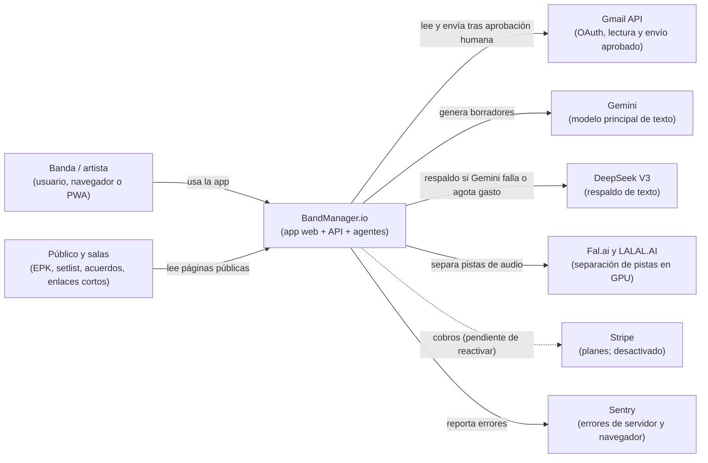
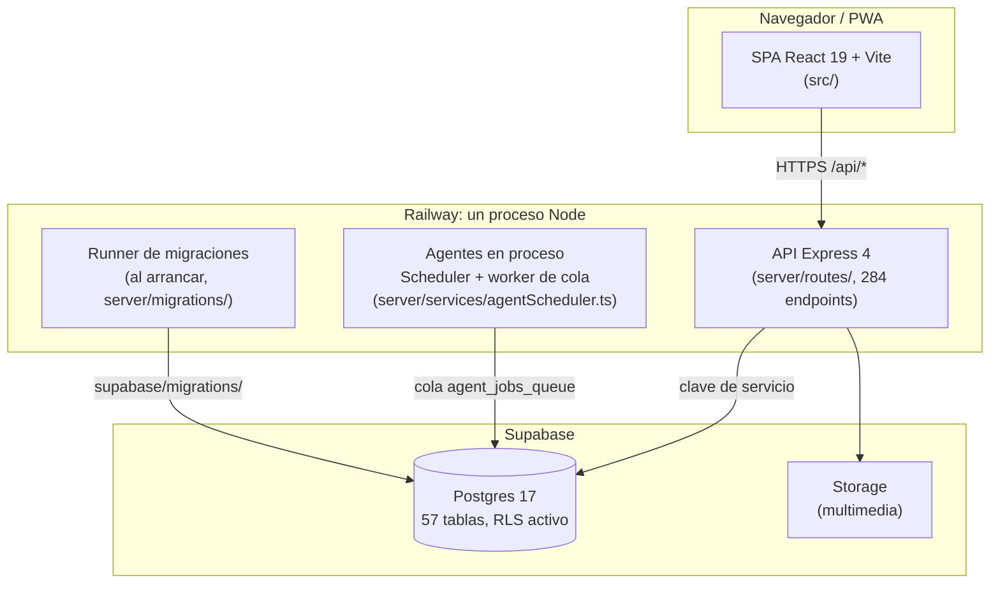

# Arquitectura de BandManager.io

Vista de alto nivel para leer en 10 minutos. El detalle de cada decisión está en [docs/adr/](./adr/README.md); el grafo navegable de módulos, en [docs/knowledge_graph/](./knowledge_graph/index.md); el del motor de audio, en [DOCUMENTACION_ARQUITECTURA_SISTEMA.md](./referencia/DOCUMENTACION_ARQUITECTURA_SISTEMA.md).

## 1. Contexto del sistema (nivel C1)

Quién usa BandManager y con qué sistemas externos habla.

## 2. Contenedores (nivel C2)

Lo que se despliega y cómo se comunica.

## 3. Reglas que atraviesan todo el sistema

Estas no se ven en un diagrama; son las que más preguntas generan. Cada una tiene su ADR.

| Regla | Dónde se cumple | ADR |
|---|---|---|
| Toda ruta de datos de banda resuelve `band_id` en servidor | `getTargetBandId` en `server/utils/bandAccess.ts` | [0004](./adr/0004-band-id-resuelto-en-servidor.md) |
| Ningún envío de agente sale sin aprobación humana | Enviador y Lector, con reglas de AGENTS.md §3 | [0005](./adr/0005-aprobacion-humana-agentes.md) |
| La IA tiene respaldo: Gemini primero, DeepSeek después | `server/services/pitchEngine.ts` y `server/ai.ts` | [0006](./adr/0006-ia-multiproveedor.md) |
| Los agentes se ejecutan en el mismo proceso que la API | `server/services/agentScheduler.ts` | [0007](./adr/0007-scheduler-en-proceso.md) |

## 4. Límites conocidos

- **Una sola instancia.** El scheduler y el limitador de ritmo viven en memoria del proceso. Escalar a dos instancias exige mover esa coordinación a la base de datos o a una cola ([0007](./adr/0007-scheduler-en-proceso.md)).
- **Esquema en dos sitios.** Las migraciones del runner y 12 ficheros sueltos. Ver [0008](./adr/0008-migraciones-sql-versionadas.md).
- **Facturación desactivada.** El flujo de Stripe existe, pero no está activo en producción (ver `BACKLOG.md`).
